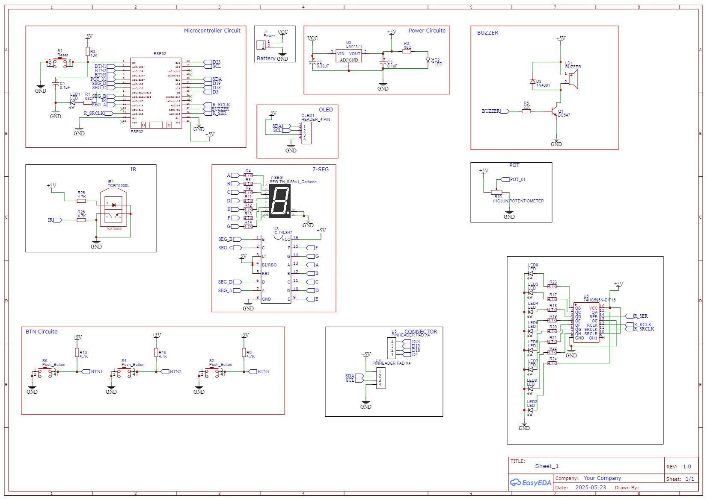
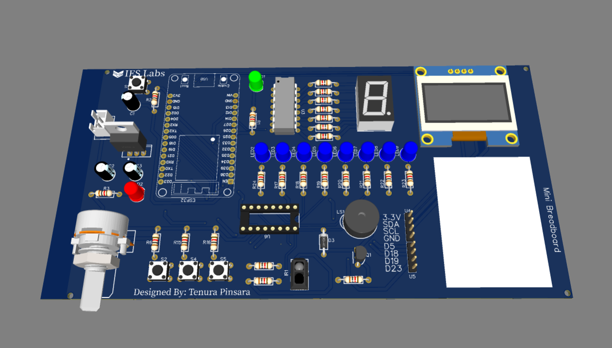

# IoT-Learning-KIT-
Beginner friendly IoT Learning KIT with ESP32 Dev Module 

##  IoT Learning Kit Version_01– Beginner to Innovator

Welcome to the **IoT Learning Kit** – a hands-on learning journey combining **ESP32**, **sensors**, **actuators**, and **real-world IoT applications**. This kit is designed to help you learn and prototype embedded systems, edge AI, and hardware interactions effectively.

###  What’s Inside

* ✅ **ESP32 Dev Board**
* ✅ **OLED Display (SSD1306)**
* ✅ **74HC595 Shift Register**
* ✅ **74LS47 BCD to 7-Segment Decoder**
* ✅ **LEDs, Buzzer**
* ✅ **Push Buttons x3**
* ✅ **Potentiometer**
* ✅ **Breadboard, jumper wires, resistors**
* ✅ **7-Segment Display**
* ✅ **IoT-ready code samples (Wi-Fi/MQTT optional)**

---

###  Key Features

*  **Modular Code Examples**: Clean Arduino/ESP32 code for each component
*  **Analog + Digital Control**: Potentiometer-based LED dimming, buttons for tones
*  **Real-Time OLED Display**: View sensor data and system states
*  **Shift Register Animations**: Knight Rider LED effects
*  **Expandable**: Designed for Edge AI, IoT dashboards, MQTT, Firebase, and more
*  **Learn by Doing**: Tied closely with project-based learning methods

---

## Pin Mapping – IoT Learning Kit (ESP32)

| Component                | Description                               | ESP32 GPIO Pin        |
|--------------------------|-------------------------------------------|------------------------|
| LED                      | Brightness controlled via potentiometer   | GPIO 25 (DAC1)         |
| Potentiometer            | Analog input to control LED brightness    | GPIO 35 (ADC)          |
| Buzzer                   | Outputs tones for buttons                 | GPIO 2                 |
| Button 1                 | Triggers Tone 1                           | GPIO 36                |
| Button 2                 | Triggers Tone 2                           | GPIO 39                |
| Button 3                 | Triggers Tone 3                           | GPIO 34                |
| OLED Display (I2C)       | 128x64 OLED (SSD1306)                     | SDA: GPIO 21           |
|                          |                                           | SCL: GPIO 22           |
| 74HC595 Shift Register   | Used for Knight Rider LED effect          |                        |
| ├─ Latch (ST_CP)         | Storage register clock pin                | GPIO 4                 |
| ├─ Clock (SH_CP)         | Shift register clock pin                  | GPIO 13                |
| └─ Data (DS)             | Serial data input                         | GPIO 15                |
| 74LS47 to 7-Segment      | Optional (BCD to 7-Segment Driver)        |                        |
| ├─ Segment A             |                                           | GPIO 14                |
| ├─ Segment B             |                                           | GPIO 26                |
| ├─ Segment C             |                                           | GPIO 33                |
| └─ Segment D             |                                           | GPIO 32                |

Note:
- GPIOs 36, 39, and 34 are **input-only** — suitable for buttons.
- Avoid using GPIOs 6–11 as they are typically reserved for flash memory on most ESP32 boards.

###  Project Demos (Examples)

*  **OLED Display with Sensors**
*  **Tone Generation with Button Controls**
*  **LED Brightness via Potentiometer**
*  **Knight Rider LED Sequence with Shift Register**
*  *(Coming soon)*: IoT Data Uplink via Wi-Fi/MQTT

## Schematic of PCB

## 3D look of PCB

## IoT KiT

**Tenura Pinsara Pasandul**
 
 Electronics & Embedded Systems |  Robotics & Edge AI Enthusiast
 
 Sharing practical knowledge in **Digital Electronics**, **Machine Learning**, and **IoT**

